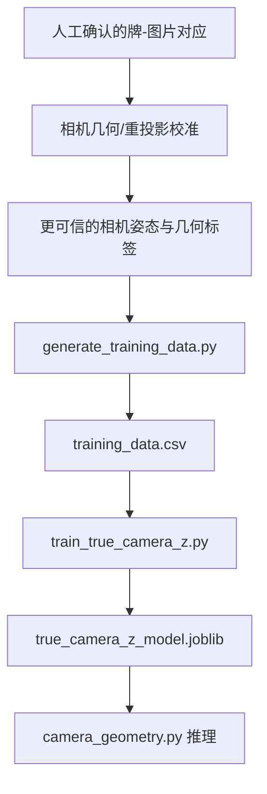

# True Camera Z 模型说明

## 1. 一句话说明

当前这套流程的主要任务是：

> 使用 DA3 深度、SAM2 mask、检测框大小和标志牌在图片中的位置，预测标志牌在相机坐标系中的真实前向深度 `Z`，单位为米。

它不是在重新标定相机内参，也不是在拟合 Brown 畸变参数。它是一个从视觉特征到真实相机深度的监督回归模型，目标是替换 `camera_sign_measure/camera_geometry.py` 中现有的经验公式 `depth_curve()`。

当前坐标约定为：

```text
+X = 相机右侧
+Y = 相机下方
+Z = 相机前方
```

因此，模型输出 `Z = 20 m` 表示标志牌沿相机光轴方向位于相机前方约 20 米。

---

## 2. 它与相机几何标定脚本的区别

两者处理的是不同层级的问题。

| 对比项 | Brown/pose 重投影标定 | 当前 True Camera Z 回归 |
|---|---|---|
| 主要问题 | 相机几何参数是否正确 | DA3 的相对深度如何转换成真实米制 Z |
| 输入 | 相机/照片位置、heading、真实牌 GIS 坐标、图片观测位置 `u,v` | DA3 深度统计、SAM2 mask、bbox、图像位置、置信度 |
| 目标 | 最小化重投影像素误差 | 最小化预测 Z 与 `true_camera_z` 的米制误差 |
| 典型输出 | `K`、Brown `D`、yaw/pitch/roll、lever/位置偏移 | `true_camera_z_model.joblib` |
| 误差单位 | 像素 `px` | 米 `m` |
| 是否处理畸变 | 是，可以拟合或应用 Brown 畸变 | 模型本身不拟合畸变 |
| 是否预测新图片的深度 | 否 | 是 |
| 在系统中的位置 | 上游几何校准 | 下游深度标定/回归 |

### 2.1 相机几何标定脚本在做什么

相机几何标定脚本使用已知的 GIS 标志牌位置和相机位置，把标志牌投影回图片：

```text
真实牌 GIS 坐标
+ 照片/GNSS 位置
+ camera heading
+ 候选 K、D、姿态和位置偏移
        ↓
预测图片坐标 u_pred, v_pred
        ↓
与人工观测 u_obs, v_obs 比较
        ↓
优化重投影误差
```

它主要回答：

> 相机焦距、主点、畸变、方向和安装偏移应该是多少，才能让一个已知世界坐标的标志牌投影到正确的像素位置？

它优化的是几何关系，不直接训练一个对任意新图片预测 Z 的视觉模型。

### 2.2 当前 Z 模型在做什么

当前模型使用已经生成的训练标签：

```text
true_camera_z
```

并学习：

```text
DA3/SAM2/bbox/图像位置特征
        ↓
真实相机前向深度 Z（米）
```

对一张没有 GIS 标志牌坐标的新图片，只要完成 YOLO、SAM2 和 DA3 推理，就可以得到模型输入，并预测该标志牌的 Z。

---

## 3. 两种方法不是互相替代，而是前后串联

推荐的完整关系是：



逻辑上：

1. 重投影标定改善相机几何关系；
2. 相机几何关系用于计算训练标签 `true_camera_z`；
3. 当前模型学习从视觉特征预测这个标签；
4. 模型部署后可在没有 GIS 真值的新图片上预测 Z。

如果上游的相机位置、heading 或真实牌匹配错误，那么 `true_camera_z` 标签也会错误。下游模型不会自动修复错误标签，而可能把这些偏差学习进去。

---

## 4. 训练标签 `true_camera_z` 从哪里来

`generate_training_data.py` 读取人工确认的：

```text
photo_wkt       照片/GNSS 世界坐标
sign_wkt        真实标志牌世界坐标
camera_heading  相机或车辆朝向
```

再根据可选的相机安装修正：

```text
yaw/pitch/roll offset
lever_forward/right/up
```

把世界坐标中的“相机到标志牌向量”转换到相机坐标系，得到：

```text
true_camera_x
true_camera_y
true_camera_z
true_camera_range
```

其中：

```text
true_camera_z = 标志牌沿相机前方轴的深度
true_camera_range = sqrt(X² + Y² + Z²)
```

模型训练目标是 `true_camera_z`，不是 `true_camera_range`。

---

## 5. 模型使用哪些输入

当前默认输入特征为：

| 特征 | 作用 |
|---|---|
| `raw_depth_median` | SAM2 mask 内 DA3 深度中位数 |
| `raw_depth_p10` | mask 内深度第 10 百分位 |
| `raw_depth_p90` | mask 内深度第 90 百分位 |
| `raw_depth_std` | mask 内深度波动程度 |
| `depth_valid_ratio` | mask 内有效深度像素比例 |
| `mask_area_ratio` | mask 面积占整张图片比例 |
| `bbox_area_ratio` | bbox 面积占整张图片比例 |
| `center_u_normalized` | 标志牌中心的归一化水平位置 |
| `center_v_normalized` | 标志牌中心的归一化垂直位置 |
| `confidence` | 检测置信度 |

这些特征在处理新图片时都能得到。

模型不会把下列真值字段作为输入：

```text
true_camera_x
true_camera_y
true_camera_z
true_camera_range
photo_wkt
sign_wkt
feature_id
```

否则会发生标签泄漏，模型上线后也无法获得这些输入。

---

## 6. `generate_training_data.py` 的职责

这个脚本负责准备训练表，不负责训练模型。

处理流程为：

```text
camera_sign.csv 中的人工 bbox
        ↓
SAM2 分割标志牌
        ↓
DA3 生成深度图
        ↓
提取 mask 内深度统计与 bbox 特征
        ↓
用 GIS/heading 计算真实相机 X、Y、Z
        ↓
写入 training_data.csv
```

主要输出：

```text
training_data.csv
failed_samples.csv
images/
depth/
masks/
```

`training_data.csv` 的每一行表示：

> 某一张图片中，对某一块真实标志牌的一次 observation。

---

## 7. `train_true_camera_z.py` 的职责

训练脚本负责：

1. 读取 `training_data.csv`；
2. 检查必需字段和有限数值；
3. 排除指定的 `feature_id` 或距离范围；
4. 使用 GroupKFold 做折外验证；
5. 比较 Ridge、Extra Trees、Random Forest 和简单比例基线；
6. 按 `feature_id` 等权 MAE 选择候选模型；
7. 使用全部有效数据重新拟合候选模型；
8. 保存模型、指标和逐行折外预测。

主要输出：

```text
true_camera_z_model.joblib
metrics.json
oof_predictions.csv
```

### 7.1 `true_camera_z_model.joblib`

保存最终候选模型及其元数据，包括：

```text
model
model_name
features
target
target_unit
coordinate_contract
minimum_prediction_m
```

部署时必须严格按照保存的 `features` 顺序构造输入。

### 7.2 `metrics.json`

记录数据量、验证方式、各模型指标和最终选择结果。

### 7.3 `oof_predictions.csv`

记录每条 observation 的折外预测。折外预测表示：

> 在预测这块牌时，模型训练数据中没有这块相同的 `feature_id`。

它用于模型比较和误差诊断，不是最终模型在完整训练集上的拟合预测。

### 7.4 如何实际运行 `train_true_camera_z.py`

#### 第一步：放置脚本

建议仓库结构为：

```text
traffic-assets-ai/
├── camera_calibration/
│   └── sign_true_depth/
│       ├── generate_training_data.py
│       ├── train_true_camera_z.py
│       └── output_full/
│           └── training_data.csv
└── camera_sign_measure/
    └── camera_geometry.py
```

也就是把训练脚本保存为：

```text
camera_calibration/sign_true_depth/train_true_camera_z.py
```

#### 第二步：激活运行环境并检查依赖

```bash
conda activate sign-ai311

python -c "import numpy, pandas, sklearn, joblib; print('training dependencies OK')"
```

如果第二条命令正常打印：

```text
training dependencies OK
```

说明可以继续。训练 Z 模型本身不加载 YOLO、SAM2 或 DA3，因为这些模型已经在生成 `training_data.csv` 时运行过了。

#### 第三步：从仓库根目录运行训练

```bash
cd /home/ubuntu/PycharmProjects/traffic-assets-ai

python camera_calibration/sign_true_depth/train_true_camera_z.py \
  camera_calibration/sign_true_depth/output_full/training_data.csv \
  --output-dir camera_calibration/sign_true_depth/model_v1 \
  --model auto \
  --n-splits 5 \
  --seed 42
```

第一个不带名称的参数是输入 CSV：

```text
camera_calibration/sign_true_depth/output_full/training_data.csv
```

`--output-dir` 指定模型和评估结果的保存目录。

#### 第四步：训练时排除已确认的异常牌

如果 `training_data.csv` 中仍包含需要排除的 `feature_id`，可以重复使用 `--exclude-feature-id`：

```bash
python camera_calibration/sign_true_depth/train_true_camera_z.py \
  camera_calibration/sign_true_depth/output_full/training_data.csv \
  --output-dir camera_calibration/sign_true_depth/model_v1 \
  --exclude-feature-id 93300000183 \
  --exclude-feature-id 93300000667 \
  --exclude-feature-id 93300000699 \
  --model auto \
  --n-splits 5 \
  --seed 42
```

如果这些 `feature_id` 在生成 `training_data.csv` 时已经排除，再传一次不会产生额外影响。

排除数据必须有明确理由，例如：

- 人工确认的牌-照片错配；
- 标志牌被计算到相机后方；
- GPS、heading 或 GIS 坐标异常；
- 明确超出当前模型定义的工作距离。

不要仅仅因为某一行误差大就自动删除。

#### 第五步：可选的距离范围限制

脚本支持：

```text
--min-z
--max-z
```

例如只训练 5–60 米工作范围：

```bash
python camera_calibration/sign_true_depth/train_true_camera_z.py \
  camera_calibration/sign_true_depth/output_full/training_data.csv \
  --output-dir camera_calibration/sign_true_depth/model_5_60m \
  --min-z 5 \
  --max-z 60 \
  --model auto \
  --n-splits 5 \
  --seed 42
```

这表示模型被定义为 5–60 米范围内的候选模型，不代表 5 米以内或 60 米以外的物体不存在。部署时也必须对超范围预测设置 `low_confidence` 或 `out_of_distribution` 标志。

#### 第六步：理解 `--model auto`

默认模式为：

```text
--model auto
```

脚本会分别交叉验证：

```text
ridge
extra_trees
random_forest
```

然后使用：

```text
feature_balanced_mae_m
```

选择候选模型。这个指标先计算每块真实牌的平均绝对误差，再让每块牌拥有相同权重。

也可以只训练指定模型：

```bash
--model ridge
```

或：

```bash
--model extra_trees
```

或：

```bash
--model random_forest
```

在正式比较阶段建议使用 `auto`。固定某个模型主要用于复现实验或做敏感性测试。

#### 第七步：检查输出目录

训练完成后应生成：

```text
camera_calibration/sign_true_depth/model_v1/
├── true_camera_z_model.joblib
├── metrics.json
└── oof_predictions.csv
```

先检查：

```bash
cat camera_calibration/sign_true_depth/model_v1/metrics.json
```

重点查看：

```text
selected_model
data.retained_rows
data.unique_feature_ids
cross_validation.n_splits
models.*.observation_mae_m
models.*.feature_balanced_mae_m
models.*.p95_abs_error_m
warnings
```

再查看逐行预测：

```bash
python - <<'PY'
import pandas as pd

p = "camera_calibration/sign_true_depth/model_v1/oof_predictions.csv"
df = pd.read_csv(p)
print(df.head())
print(df.columns.tolist())
PY
```

`oof_predictions.csv` 用于找出：

- 哪些 `feature_id` 误差最大；
- 误差是否随真实距离增加；
- 同一块牌的预测是否随车辆接近而连续下降；
- 某个模型是否只在少数样本上表现很好。

#### 第八步：在 Python 中加载保存的模型

下面示例演示模型文件的读取方式：

```python
import joblib
import numpy as np

artifact = joblib.load(
    "camera_calibration/sign_true_depth/model_v1/true_camera_z_model.joblib"
)

model = artifact["model"]
feature_names = artifact["features"]
minimum_z = artifact.get("minimum_prediction_m", 0.001)

# sample_features 必须来自新图片的 DA3、SAM2、bbox 和检测结果。
# 每个键的定义必须与 generate_training_data.py 完全一致。
sample_features = {
    "raw_depth_median": 3.2,
    "raw_depth_p10": 2.9,
    "raw_depth_p90": 3.7,
    "raw_depth_std": 0.25,
    "depth_valid_ratio": 0.99,
    "mask_area_ratio": 0.0021,
    "bbox_area_ratio": 0.0028,
    "center_u_normalized": 0.72,
    "center_v_normalized": 0.43,
    "confidence": 0.91,
}

X = np.asarray(
    [[sample_features[name] for name in feature_names]],
    dtype=float,
)

predicted_z_m = max(float(model.predict(X)[0]), minimum_z)
print("predicted camera Z (m):", predicted_z_m)
```

上面的数字只是演示输入格式，不能当作真实样本。实际部署必须从当前图片计算这些特征。

#### 第九步：常用参数汇总

| 参数 | 含义 | 默认值 |
|---|---|---|
| `training_csv` | 输入 `training_data.csv`，位置参数 | 必填 |
| `--output-dir` | 模型与评估文件保存目录 | `sign_true_depth/model` |
| `--model` | `auto/ridge/extra_trees/random_forest` | `auto` |
| `--n-splits` | GroupKFold 折数 | `5` |
| `--seed` | 树模型随机种子 | `42` |
| `--min-z` | 保留的最小真实 Z | `0` |
| `--max-z` | 保留的最大真实 Z | 无穷大 |
| `--exclude-feature-id` | 排除某块牌，可重复 | 空 |
| `--features` | 自定义逗号分隔特征列表 | 默认 10 个特征 |

#### 第十步：可复现性要求

保存每次实验时，建议使用不同输出目录：

```text
model_with_699/
model_without_699/
model_5_60m/
model_component_split/
```

同时记录：

```text
输入 training_data.csv 的版本
排除的 feature_id
min-z/max-z
seed
代码 commit
```

不要用新的训练结果覆盖旧目录，否则无法追踪模型指标为何发生变化。

---

## 8. 当前使用的验证方式

当前使用：

```text
GroupKFold(group = feature_id, n_splits = 5)
```

这样可以保证同一块真实牌的连续帧不会同时出现在训练集和验证集中。

例如：

```text
feature_id = 93300000073
frame 330, 331, 332, 333
```

这四行会一起进入训练或一起进入验证，不会被随机拆开。

### 8.1 仍需改进的验证问题

一张图片可能同时包含多块牌。当前按 `feature_id` 分组时，同一张图片中的牌可能被分到不同 fold。

虽然模型不使用整张图片的 embedding，但这些牌共享同一张 DA3 深度图、曝光、相机姿态和道路环境，因此当前指标仍可能略微乐观。

更严格的验证应建立连接分组：

```text
共享 feature_id 的行必须同组
共享 img 的行也必须同组
```

然后对这些连接组件做 GroupKFold。最终还应使用另一个完全不同的行车序列作为独立测试集。

---

## 9. 当前性能基线（79 条数据）

### 9.1 数据与实验配置

当前性能来自排除超远样本 `feature_id=93300000699` 后的一次完整训练与折外验证：

```text
observation 数量：79
独立真实牌数量：39
交叉验证：5-fold GroupKFold
分组字段：feature_id
模型选择指标：feature_balanced_mae_m
当前候选模型：Extra Trees
预测目标：true_camera_z
目标单位：米
坐标含义：相机前方 +Z
```

这些数字来自 `oof_predictions.csv` 的折外预测。对于CSV中的每一行，生成该行预测的模型没有使用相同 `feature_id` 的任何照片进行训练。

### 9.2 当前候选模型的核心指标

Extra Trees 的当前折外性能为：

| 指标 | 当前值 | 直观含义 |
|---|---:|---|
| observation MAE | 2.62 m | 每张照片平均绝对误差约 2.62 米 |
| feature-balanced MAE | 2.56 m | 每块真实牌等权后，平均误差约 2.56 米 |
| RMSE | 3.50 m | 对较大误差施加更高惩罚后的整体误差 |
| median absolute error | 2.15 m | 一半 observation 的误差不超过约 2.15 米 |
| P95 absolute error | 8.27 m | 约 95% observation 的误差不超过约 8.27 米 |
| maximum absolute error | 10.16 m | 当前最差单条 observation 的误差 |

`observation MAE` 与 `feature-balanced MAE` 很接近：

```text
2.62 m vs 2.56 m
```

这说明当前结果并没有明显被某个拥有大量连续帧的 `feature_id` 控制。

### 9.3 模型比较

| 模型 | observation MAE | 按牌等权 MAE | 中位误差 | RMSE | P95 | 最大误差 |
|---|---:|---:|---:|---:|---:|---:|
| Extra Trees | **2.62 m** | **2.56 m** | 2.15 m | **3.50 m** | **8.27 m** | **10.16 m** |
| Random Forest | 2.74 m | 2.75 m | **1.64 m** | 3.84 m | 8.92 m | 11.80 m |
| Ridge | 3.10 m | 2.86 m | 2.10 m | 4.41 m | 11.31 m | 12.53 m |
| 固定比例基线 | 5.17 m | 4.19 m | 2.69 m | 8.37 m | 23.28 m | 30.43 m |

Extra Trees 被选择是因为它的 `feature-balanced MAE` 最低，同时 observation MAE、RMSE、P95 和最大误差也最低。

Random Forest 的中位误差更低，但脚本没有按中位误差选模型。当前 Extra Trees 与 Random Forest 的差距不大，因此不能据此认定 Extra Trees 在其他道路序列上一定更好。

### 9.4 相对简单深度比例基线的提升

固定比例基线只执行：

```text
DA3 raw depth × 一个固定比例 → Z
```

Extra Trees 还使用 mask 深度分布、bbox大小、mask大小、图像位置和置信度。

与固定比例基线相比：

| 指标 | 固定比例基线 | Extra Trees | 相对改善 |
|---|---:|---:|---:|
| observation MAE | 5.17 m | 2.62 m | 约 49% |
| 按牌等权 MAE | 4.19 m | 2.56 m | 约 39% |
| RMSE | 8.37 m | 3.50 m | 约 58% |
| P95 | 23.28 m | 8.27 m | 约 64% |
| 最大误差 | 30.43 m | 10.16 m | 约 67% |

这说明当前附加特征确实提供了比“只乘一个统一比例”更多的信息。不过，这个结论目前只适用于当前数据分布和交叉验证方式。

### 9.5 按真实距离分段的性能

| 真实 Z 范围 | 样本数 | Extra Trees MAE | 中位误差 | 最大误差 |
|---|---:|---:|---:|---:|
| 10–20 m | 42 | 1.67 m | 1.32 m | 5.58 m |
| 20–30 m | 20 | 2.95 m | 2.27 m | 8.27 m |
| 30–40 m | 14 | 3.67 m | 3.16 m | 9.08 m |
| 40–60 m | 3 | 8.85 m | 9.12 m | 10.16 m |

当前最清楚的规律是：

```text
真实距离越远，Z 预测误差越大。
```

具体解释：

- 10–20 米是当前数据最密集、表现最好的范围；
- 20–30 米仍有可用信号，但平均误差接近 3 米；
- 30–40 米平均误差增加到约 3.7 米；
- 40–60 米只有 3 条数据，不能稳定估计真实泛化误差；
- 当前数据不能证明模型支持 60 米以上距离。

因此，当前工程判断应为：

```text
10–30 m：主要有效范围
30–40 m：需要谨慎使用
40 m 以上：low_confidence，且需要补充训练与测试数据
```

### 9.6 当前最大误差样本

Extra Trees 当前误差最大的几条 observation 为：

| feature_id | 图片帧 | 真实 Z | 预测 Z | 绝对误差 |
|---|---|---:|---:|---:|
| `93300000696` | `0001332.jpeg` | 43.25 m | 33.09 m | 10.16 m |
| `93300000073` | `0000330.jpeg` | 49.03 m | 39.91 m | 9.12 m |
| `93300000711` | `0001913.jpeg` | 35.11 m | 26.02 m | 9.08 m |
| `93300000703` | `0001849.jpeg` | 24.27 m | 32.54 m | 8.27 m |
| `93300000908` | `0000330.jpeg` | 49.24 m | 41.98 m | 7.26 m |

这些结果显示两类主要错误：

1. 40–50 米附近的标志牌经常被低估；
2. 少数 20–30 米标志牌也可能被明显高估。

后续诊断应回到这些行的 SAM mask、DA3深度分布、bbox大小和图像位置，不能只看最终误差数字。

### 9.7 多帧趋势性能

当前数据中共有：

```text
20 个多帧 feature_id 组
```

Extra Trees 的折外预测结果为：

```text
20/20 组都保持严格下降趋势
```

也就是说，在同一块牌的连续照片中：

```text
车辆接近标志牌
→ 真实 Z 连续下降
→ 预测 Z 也连续下降
```

这是一个重要的积极结果，说明模型捕捉到了标志牌随车辆接近产生的深度、bbox和mask变化。它也说明后续值得增加多帧融合或时序平滑。

但“趋势正确”不等于“绝对距离准确”。例如一组预测可以一直下降，同时整体偏大或偏小数米。因此多帧趋势指标必须与 MAE 一起看。

### 9.8 当前性能能说明什么

可以得出的结论：

- 当前特征到真实 Z 的映射具有可学习信号；
- Extra Trees 明显优于统一比例基线；
- 10–30 米范围表现最好；
- 对未见过的相同 `feature_id`，折外预测仍能保持较低误差；
- 多帧接近趋势在当前20组数据上全部正确。

当前还不能证明：

- 在另一条道路、另一日期或另一台相机上仍有 2.62 米 MAE；
- 40 米以上距离已经可靠；
- 当前模型可以无条件替换生产中的 `depth_curve()`；
- Extra Trees 一定优于 Random Forest；
- 当前折外指标等于独立测试集性能。

### 9.9 当前性能结论

当前候选模型可以概括为：

> 在当前相机与道路序列的 79 条 observation、39 块真实牌上，Extra Trees 的按照片折外 MAE 为 2.62 米，按真实牌等权 MAE 为 2.56 米；10–20 米范围最好，40 米以上样本不足且误差明显增大；20 个多帧牌组全部保持正确的接近趋势。

因此当前模型适合进入更严格的分组验证和独立序列测试阶段。它还不应被描述为已经完成的通用生产模型。

---

## 10. 为什么排除 `93300000699`

该样本为：

```text
true_camera_z ≈ 123.75 m
```

但训练数据绝大多数集中在 10–50 米。树模型不能可靠外推到从未充分覆盖的 100 米以上范围。

如果人工核对确认它是错配或错误标签，应作为数据错误排除。

如果它是正确的 123 米样本，则应标记为：

```text
out_of_distribution / 超出当前工作范围
```

它不应被用来证明当前模型支持 123 米。若业务需要预测 100 米以上距离，必须补充大量 60–130 米样本，而不是只保留一个极远点。

---

## 11. 畸变在两条路线中的位置

相机几何标定流程可以显式拟合 Brown 参数：

```text
k1, k2, p1, p2, k3
```

当前 Z 回归模型不输出这些参数，也不负责把畸变像素恢复为无畸变射线。

在最终系统中应分开处理：

1. Z 模型预测标志牌的前向深度；
2. `camera_geometry.py` 使用相机内参和畸变参数把像素角点转换成正确射线；
3. 使用预测 Z 和射线计算 X、Y、Z 以及标志牌实际宽高。

因此：

> “使用 Brown 畸变”与“使用 Z 回归模型”并不冲突。前者修正像素到射线的几何关系，后者修正 DA3 深度到真实米制 Z 的关系。

---

## 12. 如何接入 `camera_geometry.py`

当前代码使用经验公式：

```python
def depth_curve(z):
    return 20.26 - 15.11 * math.log(z + 0.5)
```

并计算：

```python
scale_z = depth_curve(raw_depth)
metric_depth = raw_depth * scale_z
```

新版本应改为：

```text
提取与训练时完全相同的 10 个特征
        ↓
加载 true_camera_z_model.joblib
        ↓
predict(features)
        ↓
得到 metric_depth / camera Z
```

接入时需要满足：

- 训练和推理使用完全相同的特征定义；
- 特征顺序以模型文件中的 `features` 为准；
- DA3 深度和 mask 必须使用相同缩放与腐蚀逻辑；
- 图像宽高归一化方式必须一致；
- 保留旧 `depth_curve()` 作为回退；
- 超出训练分布时输出质量标志，不要默默给出高置信结果。

建议的初版质量标志：

```text
10–30 m: normal
30–40 m: caution
40 m 以上: low_confidence
输入特征超出训练范围: out_of_distribution
```

这些阈值是当前数据阶段的工程建议，应在独立测试集完成后重新确定。

---

## 13. 当前模型能做什么、不能做什么

### 能做什么

- 把 DA3/SAM2/bbox 特征映射为相机前向 Z；
- 对未见过的 `feature_id` 做分组折外验证；
- 明显优于单一固定比例深度基线；
- 在当前数据的 10–30 米范围内提供初步有效预测；
- 保持较稳定的多帧接近趋势。

### 不能做什么

- 不能自动校正错误的 GPS、heading 或 GIS 匹配；
- 不能替代 Brown 相机标定；
- 不能单独输出可信的 yaw、pitch、roll 或相机安装偏移；
- 不能证明在另一条道路或另一台相机上也有相同精度；
- 不能可靠支持训练范围以外的 100 米以上距离；
- 不能仅凭当前交叉验证结果宣布为最终生产模型。

---

## 14. 推荐的主线推进顺序

1. 核对并冻结用于生成标签的相机几何配置；
2. 保留原始 `training_data.csv`，不要覆盖；
3. 使用“同牌且同图不跨 fold”的严格分组重新验证；
4. 在当前序列上确定候选模型和适用距离范围；
5. 使用另一个完整行车序列作为独立测试集；
6. 通过测试后，以可回退开关接入 `camera_geometry.py`；
7. 分别报告 Z、X/Y、标志牌宽高和多帧融合后的最终误差。

最终目标不是单独得到一个更好看的交叉验证分数，而是建立一条可追溯的管线：

```text
相机几何正确
→ Z 标签可信
→ Z 模型可泛化
→ 像素射线正确
→ 相机 XYZ 和标志牌尺寸可信
```
